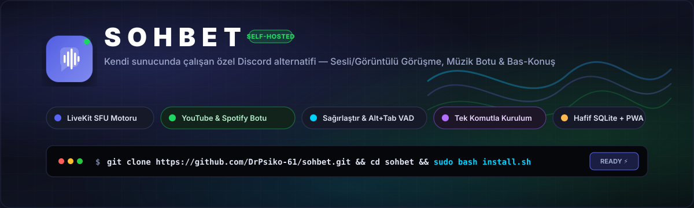
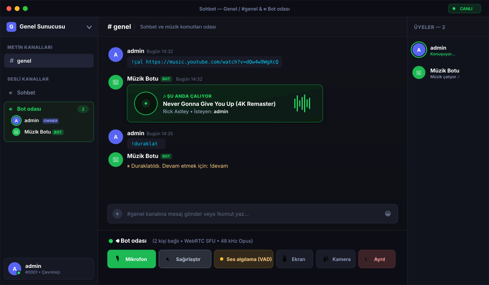

<p align="center">
  
</p>

<p align="center">
  <strong>Kendi sunucunuzda çalışan, Discord benzeri hafif, gizlilik odaklı sesli, görüntülü ve metinli sohbet platformu.</strong><br>
  <em>Dahili YouTube/Spotify müzik botu, arka planda çalışan ses algılama (VAD) ve tek komutla kurulum.</em>
</p>

<p align="center">
  <a href="#-hızlı-başlangıç-tek-komut"></a>
  <a href="#-teknoloji-yığını"></a>
  <a href="#-teknoloji-yığını"></a>
  <a href="#-özellikler"></a>
  <a href="LICENSE"></a>
</p>

---

## 📸 Canlı Arayüz Görünümü

<p align="center">
  
</p>

---

## ⚡ Hızlı Başlangıç (Tek Komut)

Herhangi bir **Ubuntu 22.04+** veya **Debian 12+** sunucuda projeyi klonlayıp kurulumu tek komutla başlatın:

```bash
git clone https://github.com/DrPsiko-61/sohbet.git
cd sohbet
sudo bash install.sh
```

### Alan adı ve otomatik SSL ile:
```bash
sudo DOMAIN=sohbet.ornek.com bash install.sh
```

> **Kurulum scripti ne yapar?**  
> `install.sh` eksik olan **Node.js 22**, **Docker**, **ffmpeg**, **yt-dlp** araçlarını kurar; LiveKit SFU konteynerini anahtarlarıyla ayağa kaldırır, systemd servisini oluşturup başlatır ve uygulamayı hazır hale getirir.

### 🔑 İlk Giriş Bilgileri

Kurulum tamamlandığında otomatik olarak tek bir yönetici hesabı oluşturulur:
- **Kullanıcı adı:** `admin`
- **Şifre:** `admin` *(İlk girişten sonra profilinizden hemen değiştirin)*
- **Davet kodu:** `deploy/.env` dosyasında otomatik üretilir; yeni kullanıcılar yalnızca bu kod ile kayıt olabilir.

---

## ✨ Öne Çıkan Özellikler

| Özellik | Açıklama |
|---|---|
| 🎙️ **LiveKit SFU Motoru** | Düşük gecikmeli, 48 kHz Opus kalitesinde grup görüşmeleri. Router'da tek bir UDP portu (`7882/udp`) yeterlidir. |
| 🤖 **Dahili Müzik Botu** | Harici bot kurmaya gerek yok! `!çal` yazarak **YouTube**, **YouTube Music** veya **Spotify** parçalarını odada dinleyin. |
| 🔇 **Sağırlaştır (Deafen)** | Discord mekaniği: basıldığında mikrofonunuz tamamen kapanır ve odadaki tüm gelen sesler susdurulur. |
| 🎧 **Arka Plan VAD & PTT** | Ses iş parçacığında (AudioWorklet) çalışan ses algılama motoru sayesinde **oyundayken veya Alt+Tab yapıldığında bile sesiniz kesilmez.** |
| 📹 **Görüntülü & Ekran Paylaşımı** | Kamera, ekran yayını ve harici video yakalama kartı (USB Capture Card) desteği. |
| 🔒 **%100 Özel & Bağımsız** | Ağır SQL sunucuları yok; hafif ve hızlı `node:sqlite` ile tüm verileriniz kendi makinenizde kalır. |
| 📱 **Tam PWA Desteği** | Telefon veya bilgisayara hafif bir yerel uygulama gibi kurulabilir. |
| 🖼️ **Profil Resmi Yükleme** | PNG, JPG, WebP veya GIF profil resmi yükleyin; resim yokken renk + baş harf avatarları gösterilir. |
| 🏷️ **Rol Etiketleri** | Kullanıcı adlarının yanında Discord tarzı rozetler: **KURUCU** (mavi), **YÖNETİCİ** (kırmızı), **MOD** (sarı), **BOT** (yeşil). |
| 👥 **Üye Listesi Paneli** | Sağ tarafta Discord benzeri üye paneli: sesli odadakiler canlı konuşma göstergesiyle, diğerleri çevrimiçi/çevrimdışı olarak listelenir. |
| ⚙️ **Sekmeli Ayarlar** | Ses ayarları sekmelere ayrıldı: **Cihazlar / Konuşma / Kamera / Ekran / Kart**. |
| ✏️ **Mesaj Düzenleme** | Gönderdiğiniz mesajları satır içi düzenleyin; "(düzenlendi)" işareti herkese yansır. |
| 🔔 **@Bahsetme & Bildirim** | `@` yazınca kullanıcı listesi açılır; etiketlenen kişiye anlık bildirim gider. |
| 🎨 **Zengin Metin** | `**kalın**`, `*italik*`, `` `kod` ``, kod blokları ve bağlantılar otomatik biçimlenir (XSS güvenli). |
| 🎤 **Sesli Mesaj** | Tek dokunuşla kayıt alın, mesaj olarak gönderin; yerleşik oynatıcıyla dinleyin. |
| 🎞️ **GIF Ekleme** | Kompozere GIF butonu: arama paneli açılır, GIF seçip gönderin. (`GIPHY_API_KEY` ile canlı arama) |
| 🔇 **Gürültü Engelleme** | Tarayıcının yerleşik RNNoise gürültü engellemesi tek anahtarla açılıp kapanır. |
| 💬 **Özel Durum Mesajı** | "yayında", "ders çalışıyorum" gibi durum mesajı; üye listesinde ve kendi kutunda görünür. |
| 🌈 **Tema Seçenekleri** | **Karanlık, Açık, Spider-Man, Superman, Deadpool** temaları arasından seçim yapın. |

---

## 🎵 Müzik Botu Komutları

Bot odasına girdikten sonra herhangi bir metin kanalından botu yönetebilirsiniz:

```
!çal <şarkı adı veya link>  → YouTube, YouTube Music veya Spotify şarkısını çalar
!duraklat                   → Çalan şarkıyı duraklatır (tekrar yazınca devam eder)
!devam                      → Duraklatılan şarkıyı devam ettirir
!durdur                     → Çalmayı durdurur ve sırayı temizler
!dc                         → Botu sesli odadan çıkarır
!yardım                     → Komut listesini gösterir
```

> 💡 **İpucu:** Spotify linklerinde parça bilgisi otomatik çözülerek YouTube'dan eşlenir; DRM takılması olmadan temiz stereo ses akışı sağlanır.

---

## 🌐 Kullanılan Portlar ve Güvenlik Duvarı

| Port | Protokol | Kullanım | Not |
|---|---|---|---|
| `3300` | TCP | Web Arayüzü & WebSocket | Caddy arkasında ise dışa kapatılabilir |
| `7880` | TCP | LiveKit Sinyalleşme | WebSocket kontrol kanalı |
| `7881` | TCP | LiveKit Medya Yedek | Güvenlik duvarı UDP engelleyen ağlar için TCP geçişi |
| **`7882`** | **UDP** | **LiveKit Medya (Asıl)** | **Grup ses/video trafiğinin geçtiği ana port** |
| `80` / `443` | TCP | Caddy Ters Vekil | Alan adı tanımlandıysa otomatik HTTPS |

---

## ⚖️ Karşılaştırma

| Kriter | Discord | Sohbet (Self-Hosted) | Matrix / Element |
|---|---|---|---|
| **Veri Gizliliği** | ❌ Şirket sunucularında | ✅ **%100 Kendi sunucunda** | ✅ Kendi sunucunda |
| **RAM Tüketimi** | ~800 MB - 1.5 GB | 🟢 **~80 - 160 MB** | ~1 GB - 2 GB (Synapse) |
| **Grup Ses Altyapısı** | Özel SFU | 🟢 **Modern LiveKit SFU** | 🟡 P2P veya harici Jitsi |
| **Dahili Müzik Botu** | ❌ Üçüncü taraf / paralı | 🟢 **Kutudan çıktığı gibi hazır** | ❌ Zor yapılandırma |
| **Kurulum Süresi** | Yok (kapalı kaynak) | 🟢 **~2 dakika (Tek script)** | 🔴 30 - 60 dakika |

---

## 🛠️ Yönetim Komutları

```bash
# Servis durumunu kontrol et
systemctl status sohbet

# Canlı sunucu loglarını takip et
journalctl -u sohbet -f

# Servisi yeniden başlat
systemctl restart sohbet

# LiveKit SFU konteyner logları
cd /opt/sohbet/deploy && docker compose logs -f livekit
```

---

## 📚 Detaylı Rehberler

- **[KURULUM.md](KURULUM.md)** — Kurulum öncesi gereksinimler, VPS (DigitalOcean/Hetzner), Ev Sunucusu/Raspberry Pi (NAT döngüsü), Docker ve Nginx kurulum adımları, sorun giderme rehberi.
- **[.env.example](.env.example)** — Tüm ortam değişkenleri ve detaylı açıklamaları.

---

## 📄 Lisans

Bu proje [MIT Lisansı](LICENSE) ile lisanslanmıştır. Kendi sunucunuzda özgürce çalıştırabilir, geliştirebilir ve paylaşabilirsiniz.
